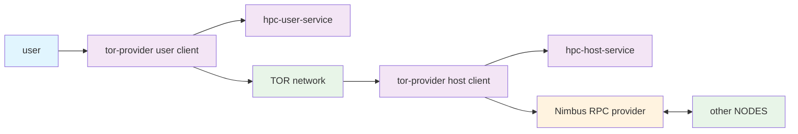

# Hidden Payment Channels

A privacy-preserving payment system that combines **[railgun](https://github.com/Railgun-Community/wallet)** and **payment channels** to enable efficient and private billing of services.

Currently, the Hidden Payment Channels service is implement as a restful API as it is easier to demonstrate the proof of concept.

The core functionality will be split into a seperate SDK later on.

This is a submission for the [RealFi Hack Funding the Commons](https://realfi-hack.devspot.app/en?activeTab=overview) hackathon.
If you are a judge start here [Submission Details](#submission-details).

## Overview

I suggest you read this overview and then watch any of these videos: [with voice](https://youtu.be/ivVgxnIoa3k), [no voice](https://youtu.be/dswG4I_NGLs)

Scenario: Bob is an RPC provider and wants to offer his RPC service to others.
He wants to be paid **privately** and offer the service **anonymously**.
**Nothing** should link back to him.

1. Bob runs a [Nimbus client](https://github.com/status-im/nimbus-eth1) at http://localhost:9545
2. Bob runs a [hpc-host-service](./service/) at http://localhost:8080 (this step is skipped once we build an SDK)
3. Bob runs a client that uses `hpc-host-service`, for example [tor-provider-host](./examples/tor-provider/)

   1. `tor-provider-host` will launch a hidden service (http://xyz.onion)
   2. will proxy all traffic to the `Nimbus client`
   3. will look for payment tickets

Result: a URL (http://xyz.onion) that serves RPC traffic and requires payment tickets attached to the headers of the request

Scenario: Alice wants to access a premium, dedicated RPC provider **privately**.
She needs a way to access it and pay for it.

1. Alice runs [hpc-user-service](./service/) at http://localhost:8080 (this step is skipped once we build an SDK)
2. Alice sends shielded funds to the her `hpc-user-service` railgun wallet
3. Alice runs [tor-provider-user](./examples/tor-provider/)

   1. `tor-provider-user` will launch a proxy waiting to receive RPC requests at http://localhost:8545
   2. she finds Bob's onion service (http://xyz.onion) (TODO: announce via smart contract)
   3. adds the RPC url into her wallet (http://localhost:8545/?p=http://xyz.onion)

Result: Alice can use the hidden RPC service, she pays with micropayments using tickets

In these extreme scenarios, both parties may want to be completely private, you can use HiddenPaymentChannels _without TOR_.

You may also use HiddenPaymentChannels to only hide the amount you are paying, and not necesarily that you are paying.

Out of the box, in order to optimise for maximum privacy, both Alice and Bob should do the following:

- Alice & Bob: run railgun service over TOR - this is easy to do but the DEMO right now does not do it
- Alice & Bob: fund their railgun wallets and wait a sometime before start using HiddenPaymentChannels
- HiddenPaymentChannels: should leverage broadcasters, does not do it right now



## Running the demo

See this [guide](./TRY_IT.md) on how to run this on your own machine.

## Architecture

The system consists of four main components:

### 1. **Smart Contracts** (`/contracts`)

- **HiddenPaymentChannels.sol**: A vault-like contract that accepts shielded WETH deposits
- Only one designated Railgun address can claim funds using payment tickets
- Anyone can top up the contract with shielded funds, but only the assigned railgun address can withdraw

### 2. **Service Layer** (`/service`)

- RESTful API that exposes Hidden Payment Channels core functionality
- Handles ticket generation, validation, and claiming
- Manages shielded wallet operations and fund tracking

### 3. **Demo Infrastructure** (`/demo-data`)

- Pre-configured wallets for demonstration purposes
- Funded Sepolia testnet accounts for testing
- Environment configuration for development

### 4. **Example Implementation** (`/examples/tor-provider`)

- Complete Rust-based example showing both provider and user clients
- Tor integration for enhanced privacy
- Demonstrates the full payment flow

### 📁 Project Structure

```
hidden-payment-channels/
├── contracts/           # Smart contracts (Solidity)
├── service/            # Node.js API service
├── examples/           # Rust implementation examples
│   └── tor-provider/   # Complete provider/user example
├── demo-data/          # Demo wallets and configuration
└── README.md
```

## ⚠️ Demo Notice

**This project is currently configured for demonstration purposes only.** Private keys are hardcoded using demo wallets from the `/demo-data` directory. **Do not use in production** without proper key management and security measures.

## For Maximum Privacy

- user must fund their railgun wallet and wait at least an hour before starting to issue tickets
- railgun RPC requests, and other HTTP traffic should be send through TOR or a mixnet

## Known Issues

- [hpc-service](./service/) is currently purely set up in demo mode, participating parties have their wallets predefined in [demo-data](./demo-data/)
- host should not immediately claim tickets but instead use an unpredictable pattern to reduce linkage between onchain activity and funds
- we currently do not use broadcasters in railgun, this exposes some metadata
- ticket tracking is on memory, this is useful for a DEMO as it allows us to start with a clean slate every time, not useful in production
- smart contracts are probably badly written
- bootstrapping `tor-provider-user` requires communication first with a free RPC provider (for railgun), this is generally fine but we can also do [this](#tor-provider)

## Roadmap

#### contracts

- support for multiple parties (not just hardcoded DEMO wallets)
- allow for the original funder to drain the wallet after a cool-off period (ex 31 days)
- reduce replay attacks from tickets
- use probabilistic tickets
- harden smart contract, security improvements, cosmetic changes

#### service

- support for multiple parties (not just hardcoded DEMO wallets)
- decouple API and SDK
- switch to probabilistic tickets
- track tickets in a local DB
- option to tunnel all railgun traffic through a socks5 proxy
- onion service discovery

#### tor-provider

- offer free mode for RPC requests specific to the railgun contract, this helps with the bootstrapping problem

## Submission Details

I've worked on two projects [Hidden Payment Channels](./service/) and [Tor Provider](./examples/tor-provider/). TorProvider _uses_ HiddenPaymentChannels to facilitate private payments.

In short, one is a service that allows for private payments across user and service, and the other is a real product (serving RPC traffic over TOR) which uses it.

Reading this README.md should give you enough insight on what these projects do and how they differ.

**Q: Which bounty (or combination) you selected?**

**A:** Logos x Tor: Privacy Infrastructure, focusing on

    - Private RPC Node Network
    - Incentivized Private RPC Nodes
    - Private Paymaster Transactions with Onion Routing

However, more accurately, this submission represents _Private Micropayments_

**Q: Design choices, privacy guarantees, and limitations**

**A:** Answered in this [README.md](#overview)

**Q: How Tor (or similar networks) is integrated**

**A:** [TOR's Arti](https://gitlab.torproject.org/tpo/core/arti) is used in [tor-provider](./examples/tor-provider/) alongside [hpc-service](./service/) to host a hidden service, proxy RPC requests, generate and validate payment tickets.
